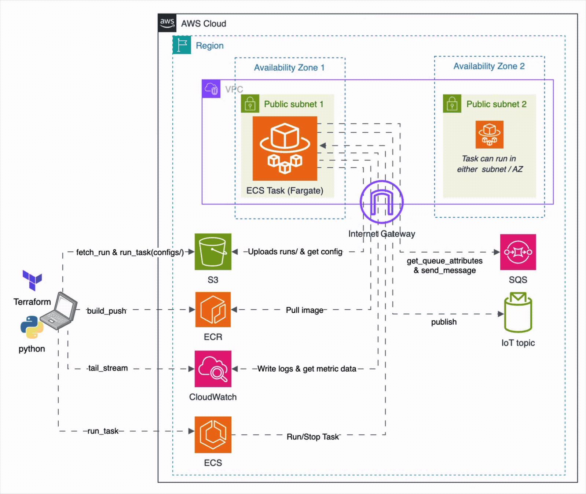
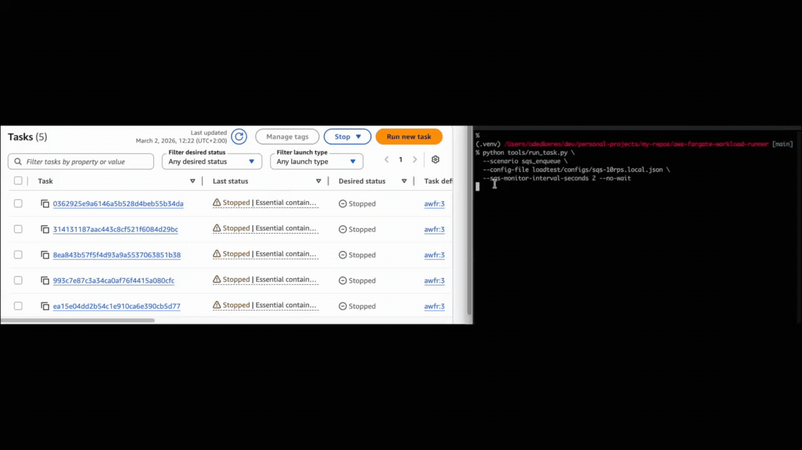
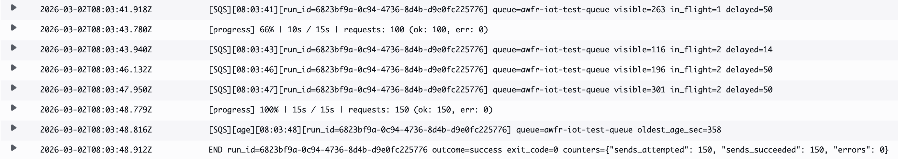
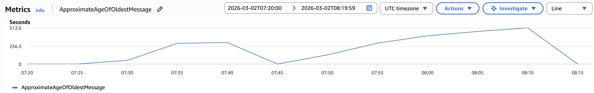

# aws-fargate-workload-runner

[](https://github.com/kerenoded/aws-fargate-workload-runner/actions/workflows/tests.yaml)
[](https://www.python.org/downloads/)
[](LICENSE)

A generic AWS stress / traffic-generator framework that runs **entirely on ECS Fargate**.  
Upload a JSON config, fire a single CLI command, and get back a `summary.json` + `metrics.jsonl` in S3.

Two scenarios are included out of the box: **IoT Core topic publish** (`iot_core_topic_publish`) and **SQS enqueue** (`sqs_enqueue`). Additional scenarios can be added by registering a new module in `src/awfr/scenarios/registry.py` — see [Adding a New Scenario](#adding-a-new-scenario).

---

## Table of Contents

- [Architecture](#architecture)
- [Prerequisites](#prerequisites)
- [Quick Start](#quick-start)
- [CLI Tools Reference](#cli-tools-reference)
- [Scenario Config Format](#scenario-config-format)
  - [iot\_core\_topic\_publish](#iot_core_topic_publish)
  - [sqs\_enqueue](#sqs_enqueue)
- [Adding a New Scenario](#adding-a-new-scenario)
- [RunTask Contract](#runtask-contract)
- [Exit Codes](#exit-codes)
- [Periodic Upload](#periodic-upload-optional)
- [SQS Queue Monitoring](#sqs-queue-monitoring-optional)
- [Cost Model](#cost-model)
- [Terraform Variables](#terraform-variables)
- [Security Notes](#security-notes)
- [Project Layout](#project-layout)
- [Running Tests](#running-tests)

---

## Architecture



```
Laptop
  ├─ tools/build_push.py  →  builds Docker image  →  pushes to ECR
  ├─ tools/run_task.py    →  uploads config to S3  →  calls ECS RunTask
  └─ tools/fetch_run.py   →  downloads artifacts from S3

ECS Fargate Task
  ├─ awfr worker  (SIGTERM-safe, typed exit codes)
  ├─ scenario (token-bucket rate limiter + worker pool)
  └─ uploader  →  periodic flush to S3 (optional)

AWS Services
  ├─ ECR          (container registry)
  ├─ ECS Fargate  (ephemeral tasks, no long-running infra)
  ├─ S3           (configs/  and  runs/)
  ├─ CloudWatch   (task logs, SQS queue depth metrics)
  ├─ IoT Core     (iot_core_topic_publish scenario)
  └─ SQS          (sqs_enqueue scenario + queue depth monitoring)
```

Each run is identified by a **RUN_ID** (uuid4) generated by the laptop CLI.  
The task exits cleanly; all state lives in S3.

---

## Prerequisites

| Tool | Minimum version | Notes |
|------|----------------|-------|
| AWS CLI | any | Configured with sufficient IAM permissions |
| Terraform | 1.6 | For provisioning infra |
| Docker | any with `buildx` | Needed for `linux/amd64` cross-builds on Apple Silicon |
| Python | 3.11 | For the laptop CLI tools and in-container runtime |

---

## Quick Start

### 1. Python environment

```bash
python3 -m venv .venv
source .venv/bin/activate
pip install -r requirements-cli.txt  # laptop / local tooling (boto3)
```

> `requirements-runtime.txt` is only used by the Docker image build — you do not need to install it locally.

### 2. Provision infrastructure

```bash
cd infra/terraform
terraform init
terraform apply -var="project=awfr-dev"
```

**Key variables** (all have defaults; override only what you need):

| Variable | Default | Description |
|----------|---------|-------------|
| `project` | `awfr` | Name prefix for every resource created |
| `region` | `eu-west-1` | AWS region |
| `image_tag` | `latest` | ECR image tag baked into the task definition |
| `artifacts_retention_days` | `30` | S3 lifecycle expiry (days) on `runs/*` and `configs/*` objects |
| `container_insights` | `false` | Enable ECS Container Insights. Optional — not required for any scenario. When enabled, CloudWatch collects CPU, memory, and network metrics for the Fargate tasks running the load test. Useful for diagnosing runner bottlenecks (e.g. CPU saturation or OOM), but increases CloudWatch costs. |
| `enable_sqs_permissions` | `false` | Attach SQS IAM policies to the task role. **Required** if you use the `sqs_enqueue` scenario **or** if you want to monitor SQS queue depth (via `sqs_monitor_interval_seconds`) while running any scenario. Setting this to `true` enforces least-privilege: permissions are scoped to the exact ARNs in `sqs_queue_arns`. |
| `sqs_queue_arns` | `[]` | List of SQS queue ARNs the task role may send to and monitor. Required when `enable_sqs_permissions=true`. Both `sqs:SendMessage` / `sqs:SendMessageBatch` (for `sqs_enqueue`) and `sqs:GetQueueAttributes` / `cloudwatch:GetMetricData` (for SQS monitoring) are scoped to this list. |

#### IAM design: least privilege + optional scenario isolation

The task role is built from small, independently-attached IAM policies — one per scenario. This means you only grant the permissions the scenarios you actually plan to run need:

- **IoT Core permissions** (`iot:DescribeEndpoint`, `iot:Publish`) are **always attached** because they are scoped tightly (publish is limited to topics in your own account and region).
- **SQS permissions** (`sqs:SendMessage`, `sqs:SendMessageBatch`, `sqs:GetQueueAttributes`, `cloudwatch:GetMetricData`) are **opt-in and off by default**. They are scoped to the exact list of queue ARNs you supply — the task cannot send to or monitor any queue not in that list. `cloudwatch:GetMetricData` is technically unscoped by ARN (AWS does not support resource-level restrictions on that action), but it is only attached when `enable_sqs_permissions=true`.

If you only ever run the IoT scenario, the task role never has SQS access. To add SQS access later without destroying and re-creating everything:

```bash
# Single queue
terraform apply \
  -var='enable_sqs_permissions=true' \
  -var='sqs_queue_arns=["arn:aws:sqs:<region>:<account_id>:<queue_name>"]'

# Multiple queues
terraform apply \
  -var='enable_sqs_permissions=true' \
  -var='sqs_queue_arns=["arn:aws:sqs:<region>:<account_id>:<queue-a>","arn:aws:sqs:<region>:<account_id>:<queue-b>"]'
```

To revoke SQS access:

```bash
terraform apply -var="enable_sqs_permissions=false"
```

> **Tip:** When adding a new scenario (see [Adding a New Scenario](#adding-a-new-scenario)), add a dedicated `iam_<scenario>.tf` file with its own `enable_<scenario>_permissions` toggle — this keeps each scenario's blast radius fully isolated.

> **Remote state (recommended for shared use):** By default Terraform stores state locally in `terraform.tfstate`. If you lose that file you lose the ability to manage or destroy the infrastructure. A ready-to-use S3 + DynamoDB backend template is provided at `infra/terraform/backend.tf.example` — copy it to `backend.tf`, fill in your bucket/table names, and re-run `terraform init` to migrate.

### 3. Build and push the Docker image

```bash
python tools/build_push.py
```

This pushes two tags: a mutable `latest` tag and an immutable `build-YYYYMMDDHHMMSS` tag. Pass `--tag` (or set `IMAGE_TAG`) to change the primary tag. The build tag is printed at the end — use it with `--image-tag` in `run_task.py` to pin a run to an exact image.

### 4. Run a scenario

#### 1) Create a local config file (recommended)

The committed files under `loadtest/configs/` are intentionally safe templates (they point at placeholder endpoints and use example ARNs). For real targets, copy one to a local-only file — git ignores anything matching `*.local.json`:

```bash
# IoT Core
cp loadtest/configs/iot-10rps-example.json loadtest/configs/iot.local.json

# SQS
cp loadtest/configs/sqs-10rps-example.json loadtest/configs/sqs.local.json
```

Then edit the local file to set your real topic pattern, queue URL, rate, or duration. Local files are never committed, so secrets and real endpoint names stay off the repo.

#### 2) Start a run

**IoT Core:**
```bash
python tools/run_task.py \
  --scenario iot_core_topic_publish \
  --config-file loadtest/configs/iot.local.json \
  --tail
```

**SQS:**
```bash
python tools/run_task.py \
  --scenario sqs_enqueue \
  --config-file loadtest/configs/sqs.local.json \
  --tail
```

After the task exits, artifacts are in `s3://<bucket>/runs/<RUN_ID>/`.



### 5. Fetch artifacts locally

```bash
python tools/fetch_run.py <RUN_ID> --out-dir test-results
```

---

## CLI Tools Reference

### `tools/run_task.py`

Launch a workload scenario on ECS Fargate.

```bash
python tools/run_task.py --scenario <name> (--config-file PATH | --config-json JSON) [options]
```

| Argument | Required | Default | Description |
|----------|----------|---------|-------------|
| `--scenario NAME` | ✅ | — | Scenario name (e.g. `iot_core_topic_publish`, `sqs_enqueue`) |
| `--config-file PATH` | ✅ (or `--config-json`) | — | Path to a local scenario config JSON file |
| `--config-json JSON` | ✅ (or `--config-file`) | — | Inline scenario config as a raw JSON string |
| `--image-tag TAG` | ❌ | task definition default | ECR image tag to use — registers a new task-def revision before launching |
| `--no-wait` | ❌ | `false` | Return immediately after submitting the task without waiting for it to finish |
| `--tail` | ❌ | `false` | Tail CloudWatch logs incrementally while the task is running |
| `--poll-seconds N` | ❌ | `15` | How often (in seconds) to poll ECS for task status when waiting |
| `--sqs-monitor-interval-seconds N` | ❌ | disabled | Inject `sqs_monitor_interval_seconds` into the runner config at launch time. The container will poll SQS queue depth every N seconds and log to CloudWatch. Overrides any value already in the config file. |
| `--sqs-monitor-arns ARN [ARN ...]` | ❌ | all queues | Inject `sqs_monitor_arns` into the runner config: monitor only these ARNs instead of all queues in `sqs_queue_arns`. Requires `--sqs-monitor-interval-seconds`. |
| `metrics_upload_interval_seconds` *(runner config JSON)* | ❌ | `0` | Set in the `runner` section of the config JSON. Periodic S3 upload interval for `metrics.jsonl`; `0` = upload only at end of run — see [Periodic Upload](#periodic-upload-optional). |

> **Task-def revision accumulation:** each `--image-tag` invocation registers a new ECS task-def revision. ECS has a soft limit of 1 million revisions per family. For frequent CI-style usage, periodically deregister old revisions with `aws ecs deregister-task-definition`.



---

### `tools/build_push.py`

Build the Docker image and push it to ECR.

```bash
python tools/build_push.py [options]
```

| Argument | Required | Default | Description |
|----------|----------|---------|-------------|
| `--tag TAG` | ❌ | `IMAGE_TAG` env var or `latest` | Primary (mutable) image tag to push. An immutable `build-YYYYMMDDHHMMSS` tag is always pushed alongside it. |
| `--platform PLATFORM` | ❌ | `linux/amd64` | Target Docker platform (useful for cross-building on Apple Silicon) |

---

### `tools/fetch_run.py`

Download run artifacts from S3 to a local directory.

```bash
python tools/fetch_run.py <RUN_ID> [options]
```

| Argument | Required | Default | Description |
|----------|----------|---------|-------------|
| `RUN_ID` | ✅ | — | UUID of the run to fetch (printed by `run_task.py` at launch) |
| `--out-dir DIR` | ❌ | `test-results` | Local directory to write artifacts into. Files land at `<DIR>/<RUN_ID>/summary.json` and `<DIR>/<RUN_ID>/metrics.jsonl`. |

---

## Scenario Config Format

Every config file is a JSON object with three top-level keys:

```json
{
  "scenario": "<scenario_name>",   // optional guardrail — must match --scenario flag if present
  "runner":   { ... },             // framework-level options (see Periodic Upload)
  "config":   { ... }              // scenario-specific fields (documented below)
}
```

---

### `iot_core_topic_publish`

Publishes MQTT messages to AWS IoT Core via the IoT Data Plane HTTP API (no MQTT client, no device registrations).

| Field | Type | Required | Description |
|-------|------|----------|-------------|
| `topic_pattern` | string | ✅ | IoT topic to publish to. Use `{device_id}` as a placeholder — it is replaced with the current device ID on every publish. Example: `"devices/{device_id}/telemetry"` |
| `device_count` | int | ✅ | Number of logical device IDs to cycle through (`device-000000` … `device-NNNNNN`). Does not create real IoT Things — it only shapes the topic and payload. |
| `publish_rate_per_second` | float | ✅ | Target publish rate across all workers combined, enforced by a token bucket. |
| `duration_seconds` | int | ✅ | How long the scenario runs in seconds. |
| `payload_template` | object | ✅ | JSON object to send as each message's payload. Any string value containing `{device_id}` is interpolated with the current device ID. |
| `concurrency` | int | ❌ | Number of parallel worker threads performing `iot:Publish` calls (default: `4`). **`publish_rate_per_second` and `concurrency` are independent controls.** The rate governs *when* work is dispatched (token bucket). Concurrency governs *how many threads* drain that work in parallel. At low RPS (e.g. 10), `concurrency=1` behaves identically to `concurrency=4` — the token bucket is the sole governor. Concurrency only matters at high RPS when the API call latency becomes a bottleneck. Rule of thumb: `concurrency ≥ target_rate × api_latency_seconds` (e.g. 100 RPS × 5 ms = 0.5 → 1 worker is enough; 500 RPS × 5 ms = 2.5 → 3 workers minimum). |

```json
{
  "scenario": "iot_core_topic_publish",
  "runner": { "metrics_upload_interval_seconds": 0 },
  "config": {
    "topic_pattern": "devices/{device_id}/telemetry",
    "device_count": 50,
    "publish_rate_per_second": 100.0,
    "duration_seconds": 60,
    "payload_template": {
      "device_id": "{device_id}",
      "event": "temperature",
      "value": 22.5,
      "unit": "celsius"
    },
    "concurrency": 8
  }
}
```

**Metrics written per publish:** `event`, `device_id`, `topic`, `status` (`ok`/`error`), `latency_ms`.

---

### `sqs_enqueue`

Sends messages to an SQS queue using `sqs:SendMessage`.

| Field | Type | Required | Description |
|-------|------|----------|-------------|
| `queue_url` | string | ✅ | Full HTTPS SQS queue URL. Example: `"https://sqs.eu-west-1.amazonaws.com/123456789012/my-queue"` |
| `message_template` | object | ✅ | JSON object used as the message body. Any string value containing `{message_id}` is interpolated with a monotonically incrementing ID (`msg-0000000000`, `msg-0000000001`, …). |
| `enqueue_rate_per_second` | float | ✅ | Target enqueue rate across all workers combined, enforced by a token bucket. |
| `duration_seconds` | int | ✅ | How long the scenario runs in seconds. |
| `concurrency` | int | ❌ | Number of parallel worker threads performing `sqs:SendMessage` calls (default: `4`). **`enqueue_rate_per_second` and `concurrency` are independent controls.** The rate governs *when* work is dispatched (token bucket). Concurrency governs *how many threads* drain that work in parallel. At low RPS (e.g. 10), `concurrency=1` behaves identically to `concurrency=4` — the token bucket is the sole governor. Concurrency only matters when API call latency would prevent a single thread from keeping up. Rule of thumb: `concurrency ≥ target_rate × api_latency_seconds` (SQS latency is typically 1–5 ms, so `4` workers cover up to ~800–4000 RPS). |

```json
{
  "scenario": "sqs_enqueue",
  "runner": { "metrics_upload_interval_seconds": 0 },
  "config": {
    "queue_url": "https://sqs.eu-west-1.amazonaws.com/123456789012/my-queue",
    "message_template": {
      "event": "order_placed",
      "order_id": "{message_id}",
      "amount": 42.0
    },
    "enqueue_rate_per_second": 50.0,
    "duration_seconds": 60,
    "concurrency": 4
  }
}
```

**Metrics written per send:** `event`, `message_id`, `status` (`ok`/`error`), `latency_ms` (or `error_code` on failure).

---

## Adding a New Scenario

1. Create `src/awfr/scenarios/<your_scenario>.py`.
2. Implement a module-level entrypoint with this exact signature:
   ```python
   def run(run_env: RunEnv, metrics_writer: MetricsWriter) -> dict:
       ...
   ```
   The return value is a plain `dict` that is merged into `summary.json` — include any scenario-level counters you want surfaced (e.g. `{"sends_succeeded": 1000, "sends_failed": 2}`).
3. Register the scenario in `src/awfr/scenarios/registry.py`:
   ```python
   from awfr.scenarios import your_scenario

   SCENARIOS = {
       ...
       "your_scenario": your_scenario.run,
   }
   ```
4. Add a sample config JSON under `loadtest/configs/`.
5. Update `README.md` with the config schema.

The registry is the single source of truth — unknown scenario names fail fast with exit code 2.

---

## RunTask Contract

Exactly **3** environment variable overrides are passed to ECS:

| Variable | Description |
|----------|-------------|
| `RUN_ID` | uuid4, generated by the laptop CLI |
| `SCENARIO` | Scenario module name |
| `CONFIG_S3_URI` | `s3://<bucket>/configs/<RUN_ID>.json` |

`ARTIFACTS_BUCKET` is baked into the task definition by Terraform and never overridden.

> **Invariant:** `CONFIG_S3_URI` must use the same bucket as `ARTIFACTS_BUCKET` — the loader validates this at startup and exits with code 2 if they differ.

> **Region:** Fargate injects `AWS_REGION` into the task environment automatically. The runner uses this as the primary region source. As a defensive fallback, `config.py` also sets `AWS_DEFAULT_REGION` from `AWS_REGION` at startup (so boto3 clients that check only `AWS_DEFAULT_REGION` behave correctly). No explicit region configuration is required from you.

---

## Exit Codes

| Code | Meaning |
|------|---------|
| 0 | Success |
| 2 | Config error (bad env vars / S3 config / unknown scenario) |
| 3 | Auth error (IAM / credentials) |
| 4 | Runtime error (scenario fault / SIGTERM) |
| 5 | Unexpected error |
| — | No exit code → OOM-kill or spot interruption |

---

## Periodic Upload (optional)

During a run, every API call outcome (success, error, latency) is appended to a local `metrics.jsonl` file inside the container. **By default this file is only uploaded to S3 once, at the very end of the run** — so if the task is killed mid-run (OOM, Spot interruption, SIGTERM) all metrics are lost.

Setting `metrics_upload_interval_seconds` in the `runner` section enables periodic mid-run snapshots:

```json
{
  "runner": { "metrics_upload_interval_seconds": 30 },
  "config": { ... }
}
```

Every N seconds, the current `metrics.jsonl` snapshot is **overwritten** at the same S3 key (`runs/<RUN_ID>/metrics.jsonl`). This means:

- If the task is killed after 2 minutes of a 10-minute run, you still have the first 2 minutes of data.
- The final upload at task exit always happens regardless of this setting, so it does not replace the periodic upload — it completes it.
- Each periodic upload is one S3 `PutObject` call. At `30s` intervals over a 5-minute run that's 10 extra requests — negligible cost. At `5s` intervals it's 60 requests — still cheap but unnecessary for most use cases.

Set to `0` (the default) to disable entirely.

---

## SQS Queue Monitoring (optional)

The worker can run a background daemon thread that periodically polls SQS queue depth attributes and prints one structured line per queue to stdout — visible in CloudWatch Logs in real time.

Configure it either via CLI flags at launch time or in the `runner` section of the config JSON.

**Via CLI (no config file change needed):**

```bash
# Monitor all queues in sqs_queue_arns every 15 seconds
python tools/run_task.py \
  --scenario sqs_enqueue \
  --config-file loadtest/configs/sqs.local.json \
  --sqs-monitor-interval-seconds 15 \
  --tail

# Monitor a specific subset of queues
python tools/run_task.py \
  --scenario sqs_enqueue \
  --config-file loadtest/configs/sqs.local.json \
  --sqs-monitor-interval-seconds 15 \
  --sqs-monitor-arns arn:aws:sqs:eu-west-1:123456789012:my-queue \
  --tail

# Multiple queues
python tools/run_task.py \
  --scenario sqs_enqueue \
  --config-file loadtest/configs/sqs.local.json \
  --sqs-monitor-interval-seconds 15 \
  --sqs-monitor-arns \
    arn:aws:sqs:eu-west-1:123456789012:queue-a \
    arn:aws:sqs:eu-west-1:123456789012:queue-b \
  --tail
```

**Via config JSON:**

```json
{
  "runner": {
    "sqs_monitor_interval_seconds": 15
  },
  "config": { ... }
}
```

This monitors **all** queues in the `sqs_queue_arns` Terraform variable (baked into the task definition). To monitor only a subset, add `sqs_monitor_arns`:

```json
{
  "runner": {
    "sqs_monitor_interval_seconds": 15,
    "sqs_monitor_arns": [
      "arn:aws:sqs:eu-west-1:123456789012:my-queue"
    ]
  },
  "config": { ... }
}
```

Each poll prints one line per queue:

```
[SQS][config][run_id=abc-123] queue=my-queue visibility_timeout_sec=30 receive_wait_sec=0
[SQS][12:03:30][run_id=abc-123] queue=my-queue visible=42 in_flight=8 delayed=0
```

The `[SQS][config]` line is printed **once per queue on the first poll** — it captures `VisibilityTimeout` and `ReceiveMessageWaitTimeSeconds`, which explain in-flight behaviour and whether long-polling is active without repeating them every interval.

`ApproximateAgeOfOldestMessage` is published to CloudWatch with a 1–2 minute lag, so it is printed on a **separate `[SQS][age]` line** at the start of monitoring, at the end of the run, and at most every 4 minutes in between — not on every poll:

```
[SQS][age][12:03:30][run_id=abc-123] queue=my-queue oldest_age_sec=14
```



The format is structured for CloudWatch Logs Insights queries, e.g.:

```
fields @timestamp, @message
| filter @message like /\[SQS\]\[\d/
| parse @message "queue=* visible=* in_flight=* delayed=*" as queue, visible, in_flight, delayed
```

To query the age snapshots:

```
fields @timestamp, @message
| filter @message like /\[SQS\]\[age\]/
| parse @message "queue=* oldest_age_sec=*" as queue, oldest_age_sec
```

To query the one-time config line:

```
fields @timestamp, @message
| filter @message like /\[SQS\]\[config\]/
| parse @message "queue=* visibility_timeout_sec=* receive_wait_sec=*" as queue, visibility_timeout_sec, receive_wait_sec
```

**IAM requirement:** the ECS task role needs `sqs:GetQueueAttributes` and `cloudwatch:GetMetricData`. Both are included automatically when `enable_sqs_permissions=true` in Terraform — no extra toggle required.

**Failure behaviour:** errors are best-effort and never affect the scenario exit code:
- `AccessDenied` → warning printed once, queue skipped for the rest of the run
- Throttling → poll cycle skipped silently, retried next interval
- Bad ARN format in config → task exits with code 2 before the scenario starts

---

## Cost Model

- **Fargate:** billed per-second on vCPU + memory, with a 1-minute minimum per task. Short smoke runs are cheap; sustained high-RPS runs accumulate quickly.
- **S3 storage:** bounded by the lifecycle rule — objects under `runs/*` and `configs/*` expire after `artifacts_retention_days` days (default 30).
- **S3 PUT requests:** one upload at end of run by default. Enabling `metrics_upload_interval_seconds` increases PUT count proportionally — keep it off unless you need mid-run visibility.
- **CloudWatch Logs:** retention is set to 3–7 days by default (see `logs.tf`). Each task emits minimal stdout (start line + end line + scenario output), so log volume is low.
- **Container Insights:** off by default. Enabling it (`container_insights = true`) adds CloudWatch metrics and increases cost noticeably for high-frequency runs.

---

## Terraform Variables

| Variable | Default | Description |
|----------|---------|-------------|
| `project` | `awfr` | Name prefix for all resources |
| `region` | `eu-west-1` | AWS region |
| `image_tag` | `latest` | ECR image tag used in the task definition |
| `artifacts_retention_days` | `30` | S3 lifecycle expiry on `runs/*` and `configs/*` |
| `container_insights` | `false` | Enable ECS Container Insights (optional, not required for any scenario — see Key Variables above) |
| `enable_sqs_permissions` | `false` | Attach SQS IAM policies to task role (required for `sqs_enqueue` or SQS monitoring) |
| `sqs_queue_arns` | `[]` | List of SQS queue ARNs the task role may send to and monitor (required when `enable_sqs_permissions=true`) |

---

## Security Notes

- S3 bucket: SSE-S3 encryption, all public access blocked, TLS-only bucket policy.
- IAM roles use `aws:SourceAccount` to prevent the confused deputy problem.
- Task security group: egress only on TCP 443 (HTTPS) and UDP 53 (DNS). No inbound rules.
- The task execution role has only the minimum managed policy (`AmazonECSTaskExecutionRolePolicy`).
- The task role has separate scoped policies per service (`iam_task_role.tf`, `iam_iot.tf`, `iam_sqs.tf`).

**Networking:** ECS tasks run in **public subnets** with a public IP assigned. There are no inbound security group rules. Outbound traffic is restricted to HTTPS (443) for AWS API calls and DNS (53). No NAT Gateway is required or provisioned, which avoids the ~$32/month NAT Gateway cost.

---

## Project Layout

```
aws-fargate-workload-runner/
├── docker/                # Dockerfile + runtime entrypoint
├── infra/terraform/       # All AWS infrastructure as code
├── loadtest/
│   └── configs/           # Scenario config JSON files (git-ignored or committed)
├── src/awfr/              # Python package
│   ├── scenarios/         # Pluggable scenario modules
│   ├── worker.py          # In-container entrypoint
│   ├── config.py          # Env + S3 config loading
│   ├── metrics.py         # Thread-safe JSONL writer
│   ├── uploader.py        # Best-effort S3 uploader
│   ├── sqs_monitor.py     # Background SQS queue depth monitor
│   ├── progress.py        # Run progress tracking
│   ├── exit_codes.py      # Typed exit code constants
│   └── cli.py             # Container CLI entrypoint
├── tests/                 # Unit tests (pytest)
├── test-results/          # Local artifact downloads (git-ignored)
└── tools/                 # Laptop CLI scripts
    ├── run_task.py        # Launch a run
    ├── fetch_run.py       # Download artifacts
    ├── build_push.py      # Build + push to ECR
    └── tf_outputs.py      # Read Terraform outputs
```

---

## Running Tests

```bash
pip install -r requirements-dev.txt
pytest
```

---

## License

See [LICENSE](LICENSE).
